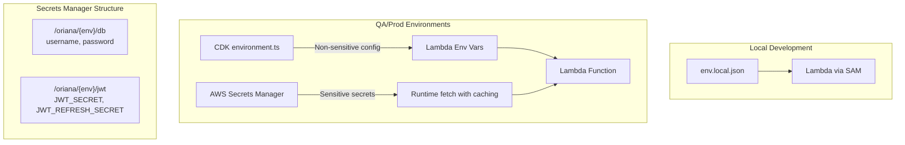

# JWT and Environment Configuration Management

## Architecture Overview



## Configuration Categories

| Config Type | Local Dev | QA/Prod | Storage Location |

|-------------|-----------|---------|------------------|

| `JWT_SECRET` | env.local.json | AWS Secrets Manager | /oriana/{env}/jwt |

| `JWT_REFRESH_SECRET` | env.local.json | AWS Secrets Manager | /oriana/{env}/jwt |

| `JWT_EXPIRES_IN` | env.local.json | CDK environment.ts | Lambda env vars |

| `JWT_REFRESH_EXPIRES_IN` | env.local.json | CDK environment.ts | Lambda env vars |

## Implementation Steps

### Step 1: Update CDK Environment Config

Add JWT configuration to [cdk/lib/config/environment.ts](cdk/lib/config/environment.ts):

- Add `JwtConfig` interface with `expiresIn`, `refreshExpiresIn`, and `secretId` properties
- Add `jwt` config to `EnvironmentConfig` interface
- Configure environment-specific JWT settings:
  - Dev: 15m access / 1d refresh (shorter for testing)
  - QA: 15m access / 7d refresh
  - Prod: 30m access / 30d refresh

### Step 2: Update Lambda Construct

Modify [cdk/lib/constructs/core/lambda-construct.ts](cdk/lib/constructs/core/lambda-construct.ts):

- Add JWT environment variables (`JWT_EXPIRES_IN`, `JWT_REFRESH_EXPIRES_IN`, `JWT_SECRET_ID`)
- Grant Secrets Manager permissions for JWT secret alongside existing DB secret

### Step 3: Create JWT Secrets Utility

Create new file `api/layers/shared/nodejs/src/utils/jwt-secrets.ts`:

- Follow the same pattern as [secrets.ts](api/layers/shared/nodejs/src/utils/secrets.ts)
- Implement `getJwtSecrets()` function with caching (5-minute TTL)
- For local development, read from environment variables
- For deployed environments, fetch from Secrets Manager

### Step 4: Update webtoken.ts

Refactor [api/layers/shared/nodejs/src/utils/webtoken.ts](api/layers/shared/nodejs/src/utils/webtoken.ts):

- Make token functions async to support Secrets Manager fetch
- Use the new `getJwtSecrets()` utility
- Add initialization function for pre-warming secrets cache

### Step 5: Update Local Development Files

Update [cdk/env.template.json](cdk/env.template.json) and document required variables:

- Add `JWT_SECRET`, `JWT_REFRESH_SECRET`, `JWT_EXPIRES_IN`, `JWT_REFRESH_EXPIRES_IN`
- Update comments with instructions

### Step 6: AWS Secrets Manager Setup (Manual/Documentation)

Document the commands to create secrets in AWS:

```bash
# QA
aws secretsmanager create-secret --name /oriana/qa/jwt \
  --secret-string '{"JWT_SECRET":"<generate-strong-secret>","JWT_REFRESH_SECRET":"<generate-strong-secret>"}'

# Prod
aws secretsmanager create-secret --name /oriana/prod/jwt \
  --secret-string '{"JWT_SECRET":"<generate-strong-secret>","JWT_REFRESH_SECRET":"<generate-strong-secret>"}'
```

## Files to Modify

1. `cdk/lib/config/environment.ts` - Add JWT config interface and per-environment settings
2. `cdk/lib/constructs/core/lambda-construct.ts` - Add JWT env vars and Secrets Manager permissions
3. `api/layers/shared/nodejs/src/utils/jwt-secrets.ts` - New file for JWT secrets management
4. `api/layers/shared/nodejs/src/utils/webtoken.ts` - Refactor to use async secrets loading
5. `api/layers/shared/nodejs/src/index.ts` - Export new jwt-secrets module
6. `cdk/env.template.json` - Add JWT variables for local development

## Security Best Practices Applied

- Secrets never committed to source control
- Secrets fetched at runtime with caching to minimize API calls
- Different secrets per environment (dev/qa/prod isolation)
- Local development uses fallback defaults with clear warnings
- Production enforces secret presence (throws error if missing)