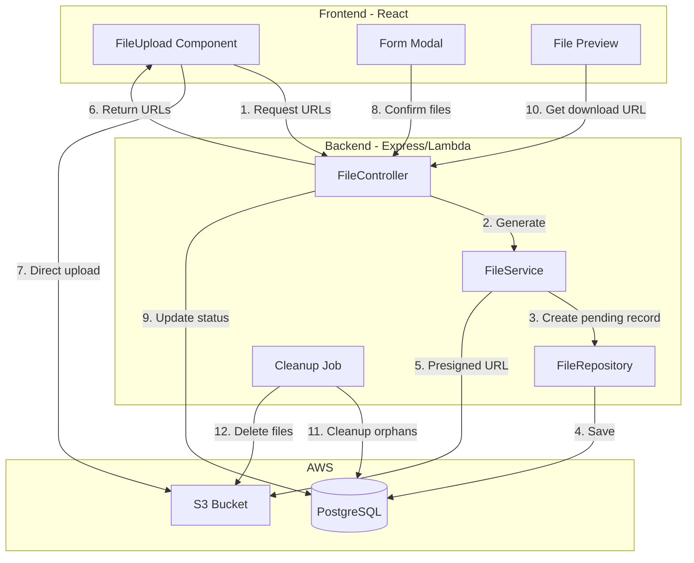

# S3 File Upload with Presigned URLs

## Architecture Overview




## Database Schema

Add to [`api/layers/shared/nodejs/prisma/schema.prisma`](api/layers/shared/nodejs/prisma/schema.prisma):

```prisma
model FileUpload {
  fileId           Int       @id @default(autoincrement()) @map("file_id")
  originalFileName String    @map("original_file_name") @db.VarChar(255)
  storedFileName   String    @map("stored_file_name") @db.VarChar(255)
  mimeType         String    @map("mime_type") @db.VarChar(100)
  fileSize         Int       @map("file_size")
  s3Key            String    @map("s3_key") @db.VarChar(500)
  s3Bucket         String    @map("s3_bucket") @db.VarChar(100)
  status           String    @default("pending") @map("status") @db.VarChar(20) // pending, confirmed, deleted
  entityType       String?   @map("entity_type") @db.VarChar(50) // dispatch, delivery, ppm, commissioning, warranty
  entityId         String?   @map("entity_id") @db.VarChar(50)
  poId             String?   @map("po_id") @db.VarChar(20)
  purchaseOrder    PurchaseOrder? @relation(fields: [poId], references: [poId], onDelete: SetNull)
  uploadedBy       Int       @map("uploaded_by")
  uploader         User      @relation(fields: [uploadedBy], references: [userId], onDelete: Restrict)
  confirmedAt      DateTime? @map("confirmed_at")
  deletedAt        DateTime? @map("deleted_at")
  createdAt        DateTime  @default(now()) @map("created_at")
  updatedAt        DateTime  @updatedAt @map("updated_at")  // Auto-updated on every modification

  @@index([status])
  @@index([entityType, entityId])
  @@index([poId])
  @@index([uploadedBy])
  @@index([createdAt])
  @@map("file_uploads")
}
```

**Note:** `fileId` uses integer auto-increment (consistent with other models like userId, roleId). `updatedAt` with `@updatedAt` is automatically updated by Prisma on every record modification.

## Backend Implementation

### 1. Install AWS SDK in Layers

Add to [`api/layers/shared/nodejs/package.json`](api/layers/shared/nodejs/package.json):

```json
"dependencies": {
  "@aws-sdk/client-s3": "^3.700.0",
  "@aws-sdk/s3-request-presigner": "^3.700.0"
}
```

**Why in layers?** AWS SDK will be shared across:

- File upload lambda (presigned URL generation)
- Cleanup job lambda (delete orphaned files from S3)

### 2. File Module Structure (Hybrid Approach)

**S3 Utilities in Layers** (reusable across lambdas):

```javascript
api/layers/shared/nodejs/
├── utils/
│   └── s3.ts              # S3 client, presigned URL generation
└── package.json           # Add @aws-sdk/client-s3, @aws-sdk/s3-request-presigner
```

**Business Logic in src/** (CSR pattern):

```javascript
api/src/
├── controllers/FileController.ts
├── services/FileService.ts
├── repositories/FileRepository.ts
└── schemas/
    ├── request/FileRequest.ts
    └── response/FileResponse.ts
```

**Why this structure:**

- S3 utilities can be shared by file upload lambda AND cleanup job lambda
- Follows existing pattern: Prisma in layers, repositories in src/
- Single S3 client initialization for better connection management

### 3. API Endpoints

| Method | Endpoint | Description ||--------|----------|-------------|| POST | `/files/presigned-urls` | Generate presigned upload URLs (creates pending records) || POST | `/files/confirm` | Confirm uploaded files and link to entity || GET | `/files/:fileId/download-url` | Get presigned download URL || GET | `/files/entity/:entityType/:entityId` | Get files for an entity || DELETE | `/files/:fileId` | Soft delete a file |

### 4. S3 Path Structure

```javascript
 {bucket}/
└── uploads/
    └── {poId}/
        └── {entityType}/
            └── {entityId}/
                └── {uuid}_{originalFileName}
```

Example: `uploads/OSG-00000001/dispatch/D001/a1b2c3d4_invoice.pdf`

## Frontend Implementation

### 1. Update FileUpload Component

Modify [`ui/src/Components/POManagement/FileUpload.tsx`](ui/src/Components/POManagement/FileUpload.tsx) to:

- Request presigned URLs before upload
- Upload directly to S3
- Track file IDs for confirmation
- Show upload progress

### 2. Create File API Service

Add to [`ui/src/store/api/fileApi.ts`](ui/src/store/api/fileApi.ts):

- `useGetPresignedUploadUrlsMutation`
- `useConfirmFilesMutation`
- `useGetDownloadUrlQuery`
- `useGetEntityFilesQuery`
- `useDeleteFileMutation`

### 3. File Preview Component

Create [`ui/src/Components/POManagement/FilePreview.tsx`](ui/src/Components/POManagement/FilePreview.tsx):

- Display file icons based on type (PDF, Image, Excel, Word)
- Clickable to open download URL in new tab
- Show file name on hover

## CDK Infrastructure

Add S3 bucket to CDK stack:

- Bucket with CORS configuration for direct browser uploads
- Lifecycle rule to delete objects with "pending" status after 24 hours (via tagging)
- IAM policies for presigned URL generation

## Implementation Phases

### Phase 1: Backend Foundation

1. Add AWS SDK dependencies to `layers/shared/nodejs/package.json`
2. Create S3 utilities in `layers/shared/nodejs/utils/s3.ts`
3. Add FileUpload model to Prisma schema (integer ID, auto updatedAt)
4. Run Prisma migration
5. Add environment variables for S3 (bucket name, region)

### Phase 2: File CSR Implementation

1. Create FileRepository with CRUD operations
2. Create FileService (uses S3 utils from layers)
3. Create FileController with all endpoints
4. Create request/response schemas
5. Create file.lambda.ts and register routes

### Phase 3: API Endpoints

1. POST `/files/presigned-urls` - Generate presigned upload URLs
2. POST `/files/confirm` - Confirm files and link to entity
3. GET `/files/:fileId/download-url` - Get presigned download URL
4. GET `/files/entity/:entityType/:entityId` - List files for entity
5. DELETE `/files/:fileId` - Soft delete file

### Phase 4: Frontend Integration

1. Create fileApi.ts with RTK Query endpoints
2. Update FileUpload component for S3 direct upload with progress
3. Create FilePreview component with icons and download
4. Update all form modals (Dispatch, Delivery, PPM, Commissioning, Warranty)

### Phase 5: Infrastructure and Cleanup

1. Add S3 bucket to CDK with CORS configuration
2. Create fileCleanup.lambda.ts for orphaned files
3. Add file upload permissions to constants
4. Create comprehensive documentation

## Key Files to Create/Modify

| File | Action ||------|--------|| `api/layers/shared/nodejs/prisma/schema.prisma` | Add FileUpload model || `api/layers/shared/nodejs/utils/s3.ts` | Create S3 client and presigned URL utilities || `api/layers/shared/nodejs/package.json` | Add AWS SDK dependencies || `api/src/repositories/FileRepository.ts` | Create || `api/src/services/FileService.ts` | Create (uses S3 utils from layers) || `api/src/controllers/FileController.ts` | Create || `api/src/schemas/request/FileRequest.ts` | Create || `api/src/schemas/response/FileResponse.ts` | Create || `api/src/lambdas/file.lambda.ts` | Create file upload lambda || `api/src/lambdas/fileCleanup.lambda.ts` | Create cleanup job lambda || `ui/src/store/api/fileApi.ts` | Create || `ui/src/Components/POManagement/FileUpload.tsx` | Modify for S3 direct upload || `ui/src/Components/POManagement/FilePreview.tsx` | Create || `ui/src/Components/POManagement/DispatchDetailsModal.tsx` | Modify for preview |